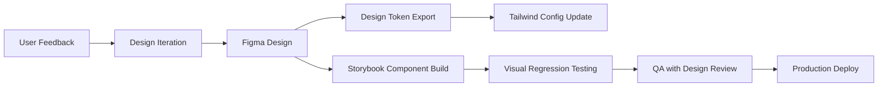

# ProNeighbor - UI/UX Design Document
**Version:** 1.0  
**Date:** May 2026  
**Status:** Draft  

---

## 1. Design Principles

### 1.1 Core Philosophy
> "Trust-first, community-centered, frictionless"

### 1.2 Guiding Principles
| Principle | Description | Implementation Example |
|-----------|-------------|----------------------|
| **Trust by Design** | Every interaction should reinforce safety and verification | Verification badges prominently displayed on profiles |
| **Community First** | Prioritize local relevance and social proof | Society-specific feeds, neighbor endorsements |
| **Frictionless Flow** | Minimize steps to complete key actions | One-tap booking for returning users |
| **Accessible to All** | Inclusive design for diverse residents | WCAG 2.1 AA compliance, large tap targets |
| **Mobile-First** | Optimized for on-the-go usage | Responsive PWA, offline-capable core flows |

---

## 2. User Journey Maps

### 2.1 Resident: First Booking Journey
```
1. Landing Page
   ↓
2. Sign Up / Login (OTP flow)
   ↓
3. Residency Verification (upload proof)
   ↓ [Pending Admin Approval]
4. Onboarding: Select interests, set preferences
   ↓
5. Home Dashboard: Browse categories or search
   ↓
6. Professional Profile: View details, reviews, availability
   ↓
7. Booking Request: Select time, add notes, confirm
   ↓
8. Payment: Wallet balance check → Razorpay top-up if needed
   ↓
9. Confirmation: Booking details + chat initiation
   ↓
10. Post-Service: Rate & review, tip option
```

### 2.2 Professional: Profile Setup Journey
```
1. Sign Up as Professional
   ↓
2. Basic Profile: Name, photo, contact
   ↓
3. Service Setup: Categories, pricing, bio, experience
   ↓
4. Verification: Upload ID, certifications, address proof
   ↓ [Admin Review]
5. Profile Goes Live: Visible in marketplace
   ↓
6. First Booking Notification → Accept/Decline
   ↓
7. Service Delivery: In-app chat, location navigation
   ↓
8. Completion: Mark done, receive payment, request review
```

---

## 3. Information Architecture

### 3.1 Global Navigation Structure
```
┌─────────────────────────────────┐
│ [Logo]  [Search]  [Notifs] [Profile] │
├─────────────────────────────────┤
│ • Home/Dashboard                │
│ • Browse Professionals          │
│ • My Bookings                   │
│ • Messages                      │
│ • Wallet                        │
│ • Community Feed                │
│ • Account Settings              │
└─────────────────────────────────┘
```

### 3.2 Role-Based Navigation Differences

#### Resident View
```
Home
├─ Quick Actions: [Book Pro] [View Bookings] [Chat]
├─ Featured Categories
├─ Nearby Professionals (society-filtered)
├─ Community Updates
└─ Wallet Balance (prominent)

Browse
├─ Categories Grid: Plumbing, Electrical, CA, Tutoring...
├─ Filters: [Rating 4+] [Available Today] [Verified] [Price Range]
├─ Sort: [Relevance] [Rating] [Price: Low-High] [Distance]
└─ Professional Cards (see Component Library)

My Bookings
├─ Tabs: [Upcoming] [Completed] [Cancelled]
├─ Booking Card: Status badge, pro info, date/time, actions
└─ Empty State: "No bookings yet" + CTA to browse

Messages
├─ Conversation List: Avatar, name, last message, timestamp, unread badge
├─ Chat View: Message bubbles, attachment button, send input
└─ System Messages: Booking updates, payment confirmations

Wallet
├─ Balance Card: Large display, "Add Coins" button
├─ Transaction History: Date, description, amount, status
├─ Top-up Flow: Amount selector → Razorpay → Confirmation
└─ Payout Info (for pros): Bank details, withdrawal history
```

#### Professional View
```
Home (Pro Dashboard)
├─ Quick Stats: [Today's Bookings] [Pending Requests] [Earnings]
├─ Upcoming Schedule: Timeline view of confirmed bookings
├─ New Requests: Action cards with Accept/Decline buttons
└─ Profile Completion Progress Bar

My Services
├─ Service List: Category, title, price, status toggle
├─ Add/Edit Service: Form with category, description, pricing, duration
├─ Availability Settings: Working hours, buffer time, blackout dates
└─ Performance Metrics: Rating, completion rate, response time

Bookings (Pro)
├─ Tabs: [Pending] [Confirmed] [In Progress] [Completed]
├─ Booking Detail: Resident info, service details, chat button, actions
├─ Completion Flow: Mark done → Add notes → Request review → Receive payment

Earnings
├─ Balance Overview: Available, pending, withdrawn
├─ Transaction Ledger: Booking payments, platform fees, payouts
├─ Payout Request: Amount, bank selection, confirmation
└─ Tax Documents: Download invoices (Phase 2)
```

#### Admin View
```
Dashboard
├─ Key Metrics: Total users, active bookings, verification queue
├─ Quick Actions: [Review Verifications] [Resolve Disputes] [Broadcast]
├─ Recent Activity Log: User signups, bookings, reports

User Management
├─ User Table: Search, filter by role/society/status, bulk actions
├─ User Detail: Profile, verification docs, booking history, actions
└─ Verification Review: Side-by-side doc viewer, approve/reject with notes

Society Management
├─ Society List: Name, resident count, admin contacts, status
├─ Society Setup: Configure settings, assign admins, customize branding
└─ Analytics: Adoption metrics, engagement trends per society

Content Moderation
├─ Reported Content Queue: Messages, reviews, posts with context
├─ Action Panel: Warn, remove content, suspend user, escalate
└─ Audit Trail: Moderator actions with timestamps and rationale

System Settings
├─ Category Management: Add/edit service categories, icons, descriptions
├─ Pricing Rules: Platform fee %, minimum booking value, cancellation policies
├─ Feature Flags: Toggle beta features, A/B test configurations
└─ Compliance: Data retention policies, export tools, legal docs
```

---

## 4. Component Library

### 4.1 Core UI Components

#### Professional Card (Browse View)
```tsx
// Design Spec
┌─────────────────────────────────┐
│ [Avatar]  Name ★4.8 (24) [✓Verified] │
│ Category: Electrician • Society: Prestige Towers │
│ ─────────────────────────────── │
│ • 8+ years experience          │
│ • ₹500/hour • Available today  │
│ • "Specializing in residential wiring" │
│ ─────────────────────────────── │
│ [View Profile] [Book Now]      │
└─────────────────────────────────┘

// States:
- Default: As above
- Loading: Skeleton with shimmer animation
- Unverified: Gray badge, tooltip "Verification pending"
- Offline: "Not available today" badge, disabled Book Now
- Hover (desktop): Subtle elevation, quick-preview tooltip
```

#### Booking Status Badge
```tsx
// Visual Design by Status
.requested  { bg: 'amber-100', text: 'amber-800', label: 'Requested' }
.confirmed  { bg: 'blue-100', text: 'blue-800', label: 'Confirmed' }
.in_progress{ bg: 'purple-100', text: 'purple-800', label: 'In Progress' }
.completed  { bg: 'green-100', text: 'green-800', label: 'Completed ✓' }
.cancelled  { bg: 'red-100', text: 'red-800', label: 'Cancelled' }

// Interaction:
- Click badge → Status timeline modal (for transparency)
- Admin view: Edit status dropdown with audit logging
```

#### Wallet Balance Card
```tsx
// Resident View
┌─────────────────────────────────┐
│ 💰 NeighbourCoins              │
│ ─────────────────────────────  │
│   ₹ 1,250                      │
│   (≈ 1,250 coins)              │
│ ─────────────────────────────  │
│ [＋ Add Coins]  [History]      │
└─────────────────────────────────┘

// Professional View (adds earnings)
┌─────────────────────────────────┐
│ 💼 Earnings Dashboard          │
│ ─────────────────────────────  │
│ Available: ₹3,400   Pending: ₹850 │
│ ─────────────────────────────  │
│ [Withdraw]  [Statements]       │
└─────────────────────────────────┘

// Micro-interactions:
- Balance updates with subtle count-up animation
- Low balance (<₹100): Gentle pulse + tooltip "Top up to book"
- Successful top-up: Confetti animation + success toast
```

#### Message Bubble
```tsx
// Sent Message (right-aligned)
┌─────────────────┐
│ Hi, I'd like to │
│ book for Saturday│
│ 10 AM.          │
│ ─────────────── │
│ 2:34 PM ✓✓     │
└─────────────────┘
// Styles: bg-blue-500, text-white, rounded-tr-none

// Received Message (left-aligned)
┌─────────────────┐
│ Sure! I'm       │
│ available at    │
│ that time.      │
│ ─────────────── │
│ 2:36 PM        │
└─────────────────┘
// Styles: bg-gray-100, text-gray-900, rounded-tl-none

// Attachment Preview:
[📎 invoice.pdf] 320KB [Download]
[🖼️ photo.jpg] [Expand]

// System Message (centered, muted)
─────────────────────────
🔒 Booking #BK-789 confirmed
─────────────────────────
```

### 4.2 Empty States & Error Handling

#### Empty States Design Pattern
```tsx
// Generic Empty State Component
┌─────────────────────────────────┐
│ [Illustration: Friendly character] │
│                                 │
│ No bookings yet!                │
│ Find a professional to get started. │
│                                 │
│ [Browse Professionals]          │
│ [Learn How It Works]            │
└─────────────────────────────────┘

// Context-Specific Variants:
- No messages: "Start a conversation with your booked pro"
- No wallet transactions: "Your transaction history will appear here"
- No community posts: "Be the first to share an update!"
- Verification pending: "Admin review in progress (24-48 hrs)"
```

#### Error States
```tsx
// Network Error
┌─────────────────────────────────┐
│ ⚠️ Connection Issue            │
│ We couldn't reach our servers. │
│ Please check your internet.    │
│ [Retry] [Contact Support]      │
└─────────────────────────────────┘

// Validation Error (inline)
<input className="border-red-300 focus:ring-red-500" />
<span className="text-red-600 text-sm">Please enter a valid phone number</span>

// Action Failure (toast)
🔴 Booking failed: Professional is no longer available.
[View similar pros] [Try different time]

// Permission Denied
🔐 Admin access required
This action is restricted to society administrators.
[Request Access] [Contact Support]
```

---

## 5. Visual Design System

### 5.1 Color Palette
```css
/* Primary Brand */
--color-primary-50: #f0f9ff;
--color-primary-500: #0ea5e9;   /* Sky blue - trust, communication */
--color-primary-700: #0369a1;

/* Semantic Colors */
--color-success: #22c55e;       /* Completed, verified, positive */
--color-warning: #f59e0b;       /* Pending, caution */
--color-error: #ef4444;         /* Cancelled, error, destructive */
--color-info: #3b82f6;          /* Informational, neutral actions */

/* Neutrals */
--color-gray-50: #f9fafb;
--color-gray-200: #e5e7eb;
--color-gray-500: #6b7280;
--color-gray-900: #111827;

/* Accessibility */
/* All text meets WCAG AA: contrast ratio ≥ 4.5:1 */
/* Interactive elements: focus ring 2px solid primary-500 */
```

### 5.2 Typography
```css
/* Font Stack */
font-family: 'Inter', -apple-system, BlinkMacSystemFont, 'Segoe UI', sans-serif;

/* Scale (mobile-first) */
--text-xs: 0.75rem;    /* 12px - captions, metadata */
--text-sm: 0.875rem;   /* 14px - body, buttons */
--text-base: 1rem;     /* 16px - default */
--text-lg: 1.125rem;   /* 18px - subheadings */
--text-xl: 1.25rem;    /* 20px - headings */
--text-2xl: 1.5rem;    /* 24px - page titles */

/* Weights */
--font-normal: 400;
--font-medium: 500;    /* Buttons, important labels */
--font-semibold: 600;  /* Headings, badges */
--font-bold: 700;      /* Primary CTAs, alerts */
```

### 5.3 Spacing & Layout
```css
/* 8px baseline grid */
--spacing-1: 0.25rem;  /* 4px */
--spacing-2: 0.5rem;   /* 8px */
--spacing-4: 1rem;     /* 16px - standard gap */
--spacing-6: 1.5rem;   /* 24px - section padding */
--spacing-8: 2rem;     /* 32px - page padding mobile */

/* Container widths */
--container-sm: 640px;
--container-md: 768px;
--container-lg: 1024px;
--container-xl: 1280px;

/* Mobile-first breakpoints */
--breakpoint-sm: 640px;   /* Small tablets */
--breakpoint-md: 768px;   /* Tablets */
--breakpoint-lg: 1024px;  /* Small laptops */
--breakpoint-xl: 1280px;  /* Desktops */
```

### 5.4 Iconography
- **Library**: Lucide React (consistent stroke width, accessible labels)
- **Usage Guidelines**:
  - All icons have `aria-hidden="true"` with text labels
  - Interactive icons: 44x44px minimum touch target
  - Status icons use semantic colors (✓ green, ⚠ amber, ✗ red)
- **Custom Icons**: Society logo upload, verification badge, NeighbourCoin symbol

---

## 6. Interaction Design

### 6.1 Micro-interactions
| Action | Feedback | Duration | Purpose |
|--------|----------|----------|---------|
| Button tap | Scale 0.98 → 1.0 + subtle shadow | 100ms | Confirm touch registration |
| Form submit | Loading spinner + disable button | Until response | Prevent duplicate submissions |
| Success action | Checkmark animation + toast slide-in | 300ms + 3s visible | Positive reinforcement |
| Error state | Shake animation + color shift | 200ms | Draw attention to fix |
| Wallet update | Count-up animation | 500ms | Make value changes tangible |

### 6.2 Loading States
```tsx
// Skeleton Screens (preferred over spinners for content)
<ProfessionalCard.Skeleton />
// Renders: Gray rectangles for avatar, name, rating, buttons
// Animation: Subtle shimmer (linear-gradient background movement)

// Progressive Loading:
1. Show skeleton immediately
2. Load critical content first (text before images)
3. Lazy-load images with blur-up placeholder
4. Fade-in content when ready (no layout shift)

// Pull-to-Refresh (mobile)
- Native browser behavior enhanced with custom indicator
- Spinner + "Updating..." text at top of scrollable lists
- Haptic feedback on successful refresh (if supported)
```

### 6.3 Navigation Patterns
```tsx
// Bottom Navigation (mobile PWA)
┌─────────────────┐
│ [🏠] [🔍] [📅] [💬] [👤] │
└─────────────────┘
// Active tab: primary color + label
// Inactive: gray + label
// Badge: Unread count on Messages tab

// Breadcrumbs (desktop/tablet)
Home > Browse > Electricians > Rajesh Kumar
// Clickable segments for quick navigation
// Last segment: current page (non-clickable, bold)

// Modal Navigation
- Booking confirmation: Slide-up from bottom (mobile) / center modal (desktop)
- Profile edit: Full-screen overlay with [← Back] header
- Image viewer: Lightbox with swipe navigation, pinch-to-zoom
```

---

## 7. Responsive Design Strategy

### 7.1 Breakpoint Behavior
| Viewport | Layout Changes | Navigation | Key Adaptations |
|----------|---------------|------------|----------------|
| <640px (Mobile) | Single column, stacked cards | Bottom nav, hamburger menu | Larger tap targets (44px min), simplified forms |
| 640-1023px (Tablet) | 2-column grid for browse, sidebar optional | Top nav + bottom nav hybrid | Split-view chat, expanded filters |
| ≥1024px (Desktop) | Multi-column layouts, persistent sidebar | Top navigation bar | Hover states, keyboard shortcuts, advanced filters |

### 7.2 Mobile-First Component Adaptations

#### Professional Card
```tsx
// Mobile (<640px)
- Avatar: 48px, Name + rating on same line
- Details: Collapsible "Show more" for bio
- Actions: Stacked buttons [View] [Book]

// Tablet (640-1023px)
- Avatar: 64px, Name + rating + verification badge on one line
- Details: 2-line bio preview, always visible
- Actions: Inline buttons with icons

// Desktop (≥1024px)
- Avatar: 80px, hover to enlarge
- Details: Full bio preview, quick stats grid
- Actions: Hover to reveal "Quick Book" modal
```

#### Booking Flow
```tsx
// Mobile: Stepper wizard (1 step per screen)
1. Select Service → 2. Choose Time → 3. Review → 4. Pay → 5. Confirm
// Each step: Full screen, [← Back] header, [Next] footer button

// Desktop: Multi-column form
┌─────────────────┬─────────────────┐
│ Service Details │ Time Selection  │
│ • Category      │ • Calendar      │
│ • Description   │ • Time slots    │
├─────────────────┼─────────────────┤
│ Review & Pay    │ [Confirm Booking]│
└─────────────────┴─────────────────┘
```

---

## 8. Accessibility (a11y) Implementation

### 8.1 WCAG 2.1 AA Compliance Checklist
- [ ] All images have descriptive `alt` text or `aria-hidden` if decorative
- [ ] Form inputs have associated `<label>` elements or `aria-label`
- [ ] Color is not the only means of conveying information (add icons/text)
- [ ] Focus indicators visible on all interactive elements (2px solid primary)
- [ ] Skip-to-content link for keyboard users
- [ ] ARIA live regions for dynamic updates (booking confirmations, chat messages)
- [ ] Reduced motion preference respected (`@media (prefers-reduced-motion)`)

### 8.2 Screen Reader Optimization
```tsx
// Example: Professional Card with ARIA
<article aria-labelledby={`pro-name-${pro.id}`}>
  <h3 id={`pro-name-${pro.id}`}>{pro.name}</h3>
  
  {/* Rating with accessible description */}
  <div role="img" aria-label={`Rated ${pro.rating} out of 5 stars based on ${pro.reviewCount} reviews`}>
    <StarIcon filled={true} /> {pro.rating} ({pro.reviewCount})
  </div>
  
  {/* Verification badge */}
  {pro.isVerified && (
    <span role="status" aria-live="polite">✓ Verified professional</span>
  )}
  
  {/* Action buttons with context */}
  <button aria-label={`View profile of ${pro.name}, ${pro.category}`}>
    View Profile
  </button>
</article>
```

### 8.3 Keyboard Navigation
- Tab order follows visual layout (logical reading order)
- Escape key closes modals, dropdowns, and dialogs
- Arrow keys navigate date pickers, time selectors, and rating inputs
- Enter/Space activates buttons and toggles checkboxes
- Focus trap within modals to prevent keyboard users from tabbing outside

---

## 9. Design Assets & Handoff

### 9.1 Figma File Structure
```
ProNeighbor Design System/
├─ 🎨 Foundations/
│  ├─ Colors (with semantic naming)
│  ├─ Typography scale
│  ├─ Spacing & layout grid
│  └─ Elevation/shadows
├─ 🧩 Components/
│  ├─ Atoms: Button, Input, Badge, Avatar
│  ├─ Molecules: ProfessionalCard, BookingCard, MessageBubble
│  ├─ Organisms: Header, BottomNav, BookingForm
│  └─ Templates: Dashboard, Browse, Chat
├─ 📱 Screens/
│  ├─ Resident Flow (mobile + desktop)
│  ├─ Professional Flow (mobile + desktop)
│  ├─ Admin Dashboard (desktop-optimized)
│  └─ Error/Empty states library
├─ 🔄 Prototypes/
│  ├─ Booking flow (clickable)
│  ├─ Messaging interaction
│  └─ Wallet top-up journey
└─ 📦 Export/
   ├─ SVG icons (optimized, accessible)
   ├─ Illustrations (SVG + PNG fallback)
   └─ Lottie animations (confetti, loading)
```

### 9.2 Developer Handoff Specs
- **Design Tokens**: Exported as `design-tokens.json` for Tailwind config
- **Component Props**: Documented in Storybook with arg types
- **Interaction Specs**: Figma prototype links + Lottie JSON for animations
- **Asset Delivery**: 
  - Icons: SVG sprites with semantic IDs
  - Images: WebP + JPEG fallback, responsive srcset
  - Illustrations: SVG for scalability, PNG for complex gradients

### 9.3 Design-Dev Collaboration Workflow


---

## 10. Usability Testing Plan

### 10.1 Test Scenarios (Priority Order)
1. **Critical Path**: Resident signs up → verifies residency → books first pro
2. **Trust Validation**: User evaluates professional profile credibility
3. **Payment Flow**: Wallet top-up via Razorpay (test mode)
4. **Communication**: Send message with attachment, receive reply
5. **Error Recovery**: Handle network failure during booking submission

### 10.2 Success Metrics
| Metric | Target | Measurement Method |
|--------|--------|-------------------|
| Task Completion Rate | ≥90% | Observational testing |
| Time on Task (first booking) | <5 minutes | Session recording analytics |
| System Usability Scale (SUS) | ≥75/100 | Post-test questionnaire |
| Error Rate | <5% of interactions | Clickstream analysis |
| Satisfaction (CSAT) | ≥4.5/5 | In-app micro-survey |

### 10.3 Testing Protocol
- **Participants**: 8-10 per persona (resident, pro, admin), diverse age/tech literacy
- **Environment**: Remote moderated sessions via Zoom + Lookback.io
- **Artifacts**: 
  - Task scripts with success criteria
  - Consent forms (GDPR-compliant)
  - Debrief guide for qualitative insights
- **Iteration**: Weekly design sprints incorporating test findings

---

## 11. Future Enhancements (Phase 2+)

### 11.1 Visual Upgrades
- Dark mode support with system preference detection
- Society-specific theming (custom accent colors for branded communities)
- Animated onboarding illustrations (Lottie)
- Micro-animations for trust signals (verification badge pulse on first view)

### 11.2 Interaction Innovations
- Voice input for search and messaging (Web Speech API)
- Gesture-based navigation (swipe to accept booking, pinch to zoom images)
- Haptic feedback for key actions (booking confirmation, payment success)
- Offline-first design: Queue actions when offline, sync when reconnected

### 11.3 Personalization
- Adaptive UI: Show frequent categories first, reorder nav based on usage
- Contextual hints: "You usually book on weekends" → suggest scheduling
- Accessibility auto-detection: Offer larger text mode based on system settings

---

*Document Owner: Design Team*  
*Last Updated: May 2026*  
*Next Review: After each usability testing cycle*  
*Design System Version: 1.0.0*
