# ProNeighbor - Application Flow Document
**Version:** 1.0  
**Date:** May 2026  
**Status:** Draft  

---

## 1. Overview
This document details the end-to-end user flows, state transitions, and system interactions for the ProNeighbor application. Each flow includes:
- Trigger conditions
- Step-by-step user actions
- System responses
- Error handling paths
- Success criteria

---

## 2. Core User Flows

### 2.1 Resident: Sign Up & Onboarding Flow
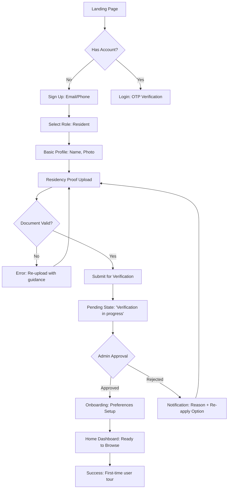

#### Detailed Steps
| Step | User Action | System Response | Validation/Logic |
|------|-------------|-----------------|-----------------|
| 1 | Enter email/phone | Send OTP via Firebase Auth | Rate limit: 3 attempts/15min |
| 2 | Enter OTP | Verify token, create Firebase user | Token expiry: 10 minutes |
| 3 | Select "Resident" role | Set `role: 'resident'` in user doc | Role immutable after creation |
| 4 | Upload residency proof | Upload to Firebase Storage → Cloudinary | File type: PDF/JPG/PNG, max 10MB |
| 5 | Submit verification | Create `verificationDocs` subdoc, notify admins | Auto-set `isVerified: false` |
| 6 | Wait for approval | Poll user doc for `isVerified` change | WebSocket or periodic query (30s interval) |
| 7 | Approved → Preferences | Show category selection, society confirmation | Save to `user.preferences` |
| 8 | Complete onboarding | Redirect to dashboard, show tooltip tour | Track `onboardingCompleted: true` |

#### Error Handling
- **OTP expired**: "Code expired. Resend?" button with cooldown timer
- **Upload failed**: Retry with progress indicator, fallback to camera capture
- **Verification rejected**: Show specific reason (blurry image, wrong doc type), allow immediate re-upload
- **Network loss**: Queue actions locally, sync when reconnected (via service worker)

---

### 2.2 Resident: Browse & Book Professional Flow
```mermaid
graph LR
    A[Home Dashboard] --> B[Browse Professionals]
    B --> C[Apply Filters: Category, Rating, Availability]
    C --> D[View Professional List]
    
    D --> E{Select Professional}
    E --> F[View Profile Detail]
    
    F --> G{Ready to Book?}
    G -->|No| H[Save to Favorites / Return to Browse]
    G -->|Yes| I[Initiate Booking]
    
    I --> J[Booking Form: Service, Time, Notes]
    J --> K[Review: Price, Pro Details, Cancellation Policy]
    
    K --> L{Wallet Balance Sufficient?}
    L -->|No| M[Top-up Flow: Razorpay Integration]
    M --> N{Payment Successful?}
    N -->|No| O[Payment Failed: Retry / Alternate Method]
    O --> M
    N -->|Yes| P[Proceed to Confirmation]
    
    L -->|Yes| P[Confirm Booking]
    
    P --> Q[Create Booking Doc in Firestore]
    Q --> R[Notify Professional via Cloud Function]
    R --> S[Show Confirmation + Start Chat]
    
    S --> T[Success: Booking #BK-XXX Created]
```

#### Key State Transitions
```typescript
// Booking Status Machine
type BookingStatus = 
  | 'draft'           // User filling form
  | 'pending_payment' // Wallet check failed, awaiting top-up
  | 'requested'       // Submitted to professional
  | 'confirmed'       // Professional accepted
  | 'in_progress'     // Service being delivered
  | 'completed'       // Service done, awaiting review
  | 'cancelled'       // Cancelled by either party
  | 'disputed';       // Issue raised, admin review needed

// Valid Transitions
const transitions = {
  draft: ['requested', 'cancelled'],
  requested: ['confirmed', 'cancelled'],
  confirmed: ['in_progress', 'cancelled'],
  'in_progress': ['completed', 'disputed'],
  completed: ['cancelled'], // For refund requests
  disputed: ['completed', 'cancelled']
};
```

#### System Interactions
1. **Filter Application** (Client-side + Firestore query)
   ```typescript
   // Optimized query with composite index
   const q = query(
     collection(db, 'users'),
     where('role', '==', 'professional'),
     where('societyId', '==', currentUser.societyId),
     where('isVerified', '==', true),
     where('categories', 'array-contains', selectedCategory),
     orderBy('rating', 'desc'),
     limit(20)
   );
   ```

2. **Booking Creation** (Cloud Function trigger)
   ```typescript
   // functions/src/bookings/createBooking.ts
   export const createBooking = functions.https.onCall(async (data, context) => {
     // 1. Validate auth & input (Zod schema)
     // 2. Check wallet balance (atomic transaction)
     // 3. Create booking document
     // 4. Deduct coins from resident wallet
     // 5. Send push notification to professional
     // 6. Create conversation document for messaging
     // 7. Return booking ID + next steps
   });
   ```

3. **Professional Notification** (Multi-channel)
   - Firebase Cloud Messaging (push notification)
   - In-app badge update (real-time via Firestore listener)
   - Email fallback (if push fails, via Firebase Extensions)

---

### 2.3 Professional: Booking Management Flow
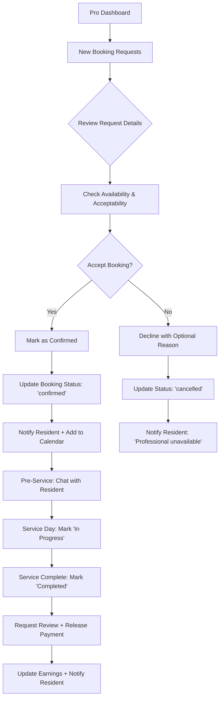

#### Professional Actions & Permissions
| Action | Required Status | Permissions Check | Side Effects |
|--------|----------------|-------------------|-------------|
| Accept booking | `requested` | `professionalId == auth.uid` | Status → `confirmed`, notify resident |
| Decline booking | `requested` | Same as above + reason required | Status → `cancelled`, refund wallet |
| Start service | `confirmed` | Same + scheduledFor ≤ now | Status → `in_progress`, log start time |
| Complete service | `in_progress` | Same + duration elapsed | Status → `completed`, trigger payout |
| Cancel (pro-initiated) | Any pre-completion | Admin override if >24h before | Penalty to pro rating, full refund |

#### Cancellation Policy Engine
```typescript
// functions/src/bookings/cancellationPolicy.ts
export function calculateRefund(booking: Booking, cancelledBy: 'resident' | 'professional'): Refund {
  const hoursBefore = differenceInHours(booking.scheduledFor, new Date());
  
  if (cancelledBy === 'professional') {
    // Professional cancellation: full refund + penalty
    return { amount: booking.price, penalty: 0.1 * booking.price, reason: 'pro_no_show' };
  }
  
  // Resident cancellation tiers
  if (hoursBefore >= 48) return { amount: booking.price, penalty: 0 }; // Full refund
  if (hoursBefore >= 24) return { amount: booking.price * 0.8, penalty: 0.2 }; // 20% fee
  if (hoursBefore >= 2) return { amount: booking.price * 0.5, penalty: 0.5 }; // 50% fee
  return { amount: 0, penalty: 1.0 }; // No refund <2 hours
}
```

---

### 2.4 Messaging Flow (Resident ↔ Professional)
```mermaid
graph LR
    A[Booking Confirmed] --> B[Auto-create Conversation]
    
    B --> C[Resident Opens Chat]
    C --> D[Send Message: Text/Attachment]
    
    D --> E[Validate: Size, Type, Content]
    E --> F[Upload Attachment to Storage]
    F --> G[Create Message Doc in Subcollection]
    
    G --> H[Update Conversation: lastMessage, updatedAt]
    H --> I[Notify Recipient via FCM]
    
    I --> J[Recipient Opens Chat]
    J --> K[Mark Messages as Read]
    K --> L[Update unreadCounts]
```

#### Message Processing Pipeline
```typescript
// Client: Send message
const sendMessage = async (conversationId: string, content: MessageContent) => {
  // 1. Local optimistic update (show message immediately)
  // 2. Validate with Zod schema
  // 3. If attachment: upload to Firebase Storage → get URL
  // 4. Write to Firestore: conversations/{id}/messages
  // 5. Update conversation.lastMessage (atomic transaction)
  // 6. Trigger Cloud Function for push notification
};

// Server: Cloud Function trigger
export const onMessageCreated = functions.firestore
  .document('conversations/{convId}/messages/{msgId}')
  .onCreate(async (snap, context) => {
    const message = snap.data();
    const conversation = await getConversation(context.params.convId);
    
    // 1. Content moderation: scan text for abuse (Google Cloud Natural Language)
    // 2. If attachment: virus scan via Cloudinary API
    // 3. Send FCM notification to other participants
    // 4. Log for audit (anonymized content)
  });
```

#### Real-time Sync Strategy
- **Primary**: Firestore `onSnapshot` listeners for live updates
- **Fallback**: Periodic polling (every 30s) if listener disconnects
- **Offline Support**: Queue messages locally, sync when online (via `firebase/firestore` offline persistence)
- **Conflict Resolution**: Last-write-wins with server timestamp (`FieldValue.serverTimestamp()`)

---

### 2.5 Wallet & Payment Flow
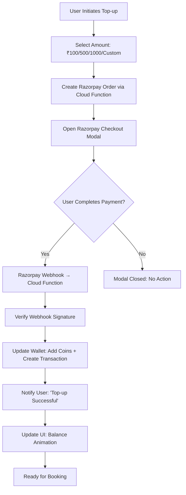

#### Razorpay Integration Security
```typescript
// Critical: Never trust client-side payment confirmation
// functions/src/payments/razorpayWebhook.ts

export const razorpayWebhook = functions.https.onRequest(async (req, res) => {
  // 1. Verify signature using Razorpay secret
  const expectedSignature = crypto
    .createHmac('sha256', RAZORPAY_WEBHOOK_SECRET)
    .update(JSON.stringify(req.body))
    .digest('hex');
  
  if (expectedSignature !== req.headers['x-razorpay-signature']) {
    return res.status(400).send('Invalid signature');
  }
  
  // 2. Process only 'payment.captured' events
  const event = req.body;
  if (event.event !== 'payment.captured') return res.status(200).send('OK');
  
  // 3. Atomic wallet update via Firestore transaction
  await runTransaction(db, async (transaction) => {
    const userRef = db.collection('users').doc(event.payload.payment.entity.notes.userId);
    const userDoc = await transaction.get(userRef);
    
    if (!userDoc.exists) throw new Error('User not found');
    
    const newBalance = userDoc.data().walletBalance + event.payload.payment.entity.amount / 100; // paise → rupees
    
    transaction.update(userRef, { walletBalance: newBalance });
    transaction.create(db.collection('wallet_transactions').doc(), {
      userId: userDoc.id,
      type: 'topup',
      amount: event.payload.payment.entity.amount / 100,
      razorpayPaymentId: event.payload.payment.entity.id,
      status: 'completed',
      createdAt: admin.firestore.FieldValue.serverTimestamp()
    });
  });
  
  res.status(200).send('OK');
});
```

#### Wallet State Management
```typescript
// Client: TanStack Query for wallet data
const { data: wallet, refetch } = useQuery({
  queryKey: ['wallet', userId],
  queryFn: () => fetchWalletBalance(userId),
  staleTime: 30_000, // 30 seconds
});

// Optimistic update for instant feedback
const topupCoins = async (amount: number) => {
  // 1. Optimistically update UI
  queryClient.setQueryData(['wallet', userId], (old: Wallet) => ({
    ...old,
    balance: old.balance + amount,
    pendingTopups: [...(old.pendingTopups || []), { amount, status: 'processing' }]
  }));
  
  try {
    // 2. Initiate Razorpay flow
    await initiateRazorpayTopup(amount);
    // 3. Refetch to confirm server state
    await refetch();
  } catch (error) {
    // 4. Rollback on failure
    queryClient.invalidateQueries(['wallet', userId]);
    showError('Top-up failed. Please try again.');
  }
};
```

---

## 3. Admin & Moderation Flows

### 3.1 Residency Verification Review Flow
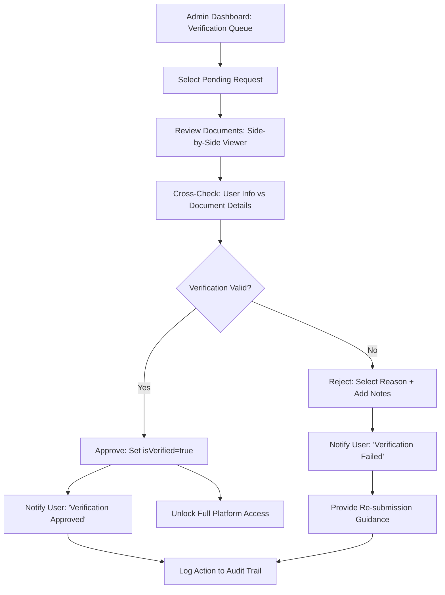

#### Admin Verification Checklist
```typescript
interface VerificationReview {
  // Document Checks
  idProof: {
    isValidFormat: boolean;      // JPG/PDF, not blurry
    nameMatches: boolean;        // Matches user profile name
    isNotExpired: boolean;       // Valid ID date
  };
  addressProof: {
    societyNameMatches: boolean; // Matches selected society
    addressDetailsClear: boolean; // Readable address
  };
  
  // Risk Assessment
  riskScore: 'low' | 'medium' | 'high'; // Based on doc quality, user history
  requiresSecondReview: boolean; // Auto-flag if riskScore === 'high'
  
  // Decision
  decision: 'approve' | 'reject' | 'request_more_info';
  rejectionReason?: 'blurry_image' | 'name_mismatch' | 'invalid_document' | 'society_mismatch';
  adminNotes?: string;
}
```

---

### 3.2 Dispute Resolution Flow
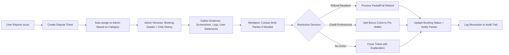

#### Dispute State Machine
```typescript
type DisputeStatus = 
  | 'submitted'    // User reported issue
  | 'under_review' // Admin investigating
  | 'mediation'    // Contacting both parties
  | 'resolved'     // Decision made, actions taken
  | 'escalated';   // Requires senior admin/legal review

type DisputeResolution = {
  type: 'refund' | 'credit' | 'warning' | 'suspension' | 'no_action';
  amount?: number; // For refunds/credits
  targetUser: 'resident' | 'professional';
  reason: string;
  adminId: string;
};
```

---

## 4. System-Level Flows

### 4.1 Authentication & Session Management
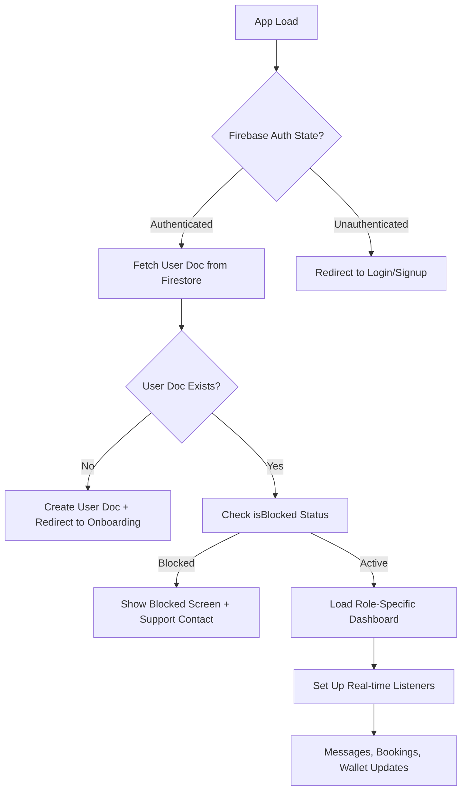

#### Token Refresh Strategy
```typescript
// Client: Auth state persistence
firebase.auth().onIdTokenChanged(async (user) => {
  if (user) {
    // 1. Get fresh ID token
    const token = await user.getIdTokenResult();
    
    // 2. Attach to API requests via interceptor
    apiClient.interceptors.request.use(config => {
      config.headers.Authorization = `Bearer ${token.token}`;
      return config;
    });
    
    // 3. Check for custom claims (role, societyId)
    if (token.claims.role) {
      setUserRole(token.claims.role as UserRole);
    }
  } else {
    // Clear auth state, redirect to login
    clearUserData();
    navigate('/login');
  }
});
```

---

### 4.2 Offline-First Data Sync
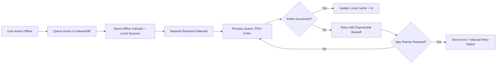

#### Offline Queue Implementation
```typescript
// services/offlineQueue.ts
class OfflineQueue {
  private queueName = 'pro-neighbor-actions';
  
  async enqueue(action: QueuedAction): Promise<void> {
    const db = await openDB('pro-neighbor', 1, {
      upgrade(db) {
        db.createObjectStore(this.queueName, { keyPath: 'id', autoIncrement: true });
      }
    });
    
    await db.add(this.queueName, {
      ...action,
      timestamp: Date.now(),
      retryCount: 0
    });
  }
  
  async processQueue(): Promise<void> {
    const actions = await this.getAllPending();
    
    for (const action of actions) {
      try {
        await this.execute(action);
        await this.markComplete(action.id);
      } catch (error) {
        if (action.retryCount < MAX_RETRIES) {
          await this.incrementRetry(action.id);
          // Exponential backoff: 1s, 2s, 4s, 8s...
          await sleep(Math.pow(2, action.retryCount) * 1000);
        } else {
          await this.markFailed(action.id, error);
          notifyUser('Action failed. Please retry manually.');
        }
      }
    }
  }
}
```

---

## 5. Error Handling & Recovery Flows

### 5.1 Global Error Boundary Flow
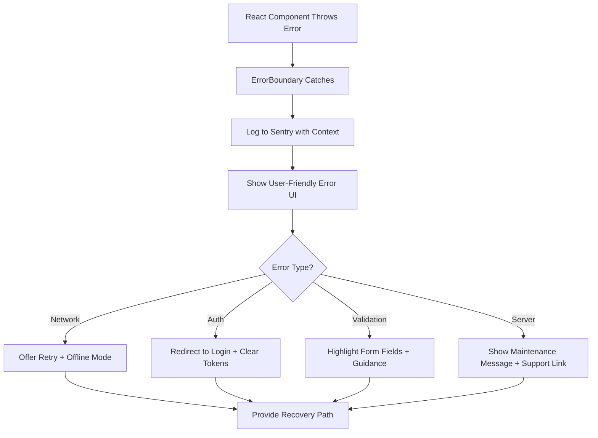

#### Error Classification & Handling
```typescript
// lib/errorHandler.ts
export class AppError extends Error {
  constructor(
    message: string,
    public code: ErrorCode,
    public userMessage: string,
    public recoverable: boolean = true
  ) {
    super(message);
  }
}

export enum ErrorCode {
  NETWORK_OFFLINE = 'NETWORK_OFFLINE',
  AUTH_EXPIRED = 'AUTH_EXPIRED',
  VALIDATION_FAILED = 'VALIDATION_FAILED',
  PAYMENT_FAILED = 'PAYMENT_FAILED',
  SERVER_ERROR = 'SERVER_ERROR',
  PERMISSION_DENIED = 'PERMISSION_DENIED'
}

// Usage example
try {
  await createBooking(bookingData);
} catch (error) {
  if (error instanceof FirebaseError && error.code === 'unavailable') {
    throw new AppError(
      'Firestore connection failed',
      ErrorCode.NETWORK_OFFLINE,
      'You appear to be offline. Check your connection and try again.',
      true
    );
  }
  // ... other error type checks
  throw error; // Re-throw unexpected errors
}
```

---

### 5.2 Payment Failure Recovery
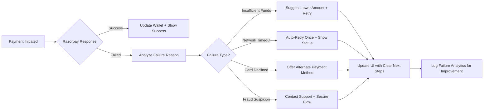

---

## 6. Analytics & Tracking Flows

### 6.1 Event Tracking Strategy
```typescript
// lib/analytics/events.ts
export const trackEvent = (
  eventName: AnalyticsEvent,
  properties: Record<string, any> = {}
) => {
  // 1. Firebase Analytics (user behavior)
  logEvent(getAnalytics(), eventName, {
    ...properties,
    userId: currentUser?.uid,
    societyId: currentUser?.societyId,
    timestamp: Date.now()
  });
  
  // 2. Custom Business Metrics (BigQuery export)
  if (import.meta.env.PROD) {
    sendToBigQuery(eventName, properties);
  }
  
  // 3. Session Replay (for debugging, opt-out respected)
  if (userConsent.sessionReplay) {
    rrweb.record({ emit: (event) => sendToSessionReplay(event) });
  }
};

// Key Events to Track
export enum AnalyticsEvent {
  // Acquisition
  SIGNUP_STARTED = 'signup_started',
  RESIDENCY_PROOF_UPLOADED = 'residency_proof_uploaded',
  
  // Activation
  FIRST_BROWSE = 'first_browse',
  FIRST_BOOKING_REQUESTED = 'first_booking_requested',
  FIRST_MESSAGE_SENT = 'first_message_sent',
  
  // Retention
  BOOKING_COMPLETED = 'booking_completed',
  REVIEW_SUBMITTED = 'review_submitted',
  WALLET_TOPUP = 'wallet_topup',
  
  // Revenue
  PAYMENT_SUCCESS = 'payment_success',
  PAYMENT_FAILED = 'payment_failed',
  
  // Trust & Safety
  VERIFICATION_APPROVED = 'verification_approved',
  DISPUTE_RAISED = 'dispute_raised',
  CONTENT_REPORTED = 'content_reported'
}
```

### 6.2 Funnel Analysis: Booking Conversion
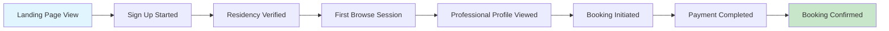

#### Drop-off Analysis Points
| Funnel Stage | Expected Drop-off | Investigation Trigger |
|-------------|------------------|----------------------|
| Sign Up → Verification | <30% | >40%: Check upload UX, doc requirements clarity |
| Verified → First Browse | <15% | >25%: Onboarding completion flow friction |
| Browse → Profile View | <50% | >65%: Search/filter relevance, pro card appeal |
| Profile View → Booking | <40% | >55%: Pricing transparency, trust signals |
| Booking → Payment | <20% | >30%: Wallet balance visibility, payment flow complexity |

---

## 7. Appendix: Flow Diagrams Source

### 7.1 Mermaid Configuration
```mermaid
%%{init: {'theme': 'base', 'themeVariables': { 'primaryColor': '#0ea5e9', 'edgeLabelBackground':'#f8fafc', 'tertiaryColor': '#f1f5f9'}}}%%
```

### 7.2 State Machine Definitions (XState Format)
```typescript
// flows/bookingMachine.ts
import { createMachine } from 'xstate';

export const bookingMachine = createMachine({
  id: 'booking',
  initial: 'idle',
  states: {
    idle: {
      on: {
        START_BOOKING: 'selecting_service'
      }
    },
    selecting_service: {
      on: {
        SERVICE_SELECTED: 'selecting_time',
        CANCEL: 'idle'
      }
    },
    selecting_time: {
      on: {
        TIME_SELECTED: 'reviewing',
        BACK: 'selecting_service'
      }
    },
    reviewing: {
      on: {
        CONFIRM: 'processing_payment',
        BACK: 'selecting_time'
      }
    },
    processing_payment: {
      invoke: {
        src: 'processPayment',
        onDone: {
          target: 'confirmed',
          actions: 'notifySuccess'
        },
        onError: {
          target: 'payment_failed',
          actions: 'notifyError'
        }
      }
    },
    payment_failed: {
      on: {
        RETRY: 'processing_payment',
        CANCEL: 'idle'
      }
    },
    confirmed: {
      type: 'final',
      entry: 'createBookingDocument'
    }
  }
});
```

---

*Document Owner: Product & Engineering Teams*  
*Last Updated: May 2026*  
*Next Review: After each major feature release*  
*Diagrams Generated: Mermaid v10.6.1*
